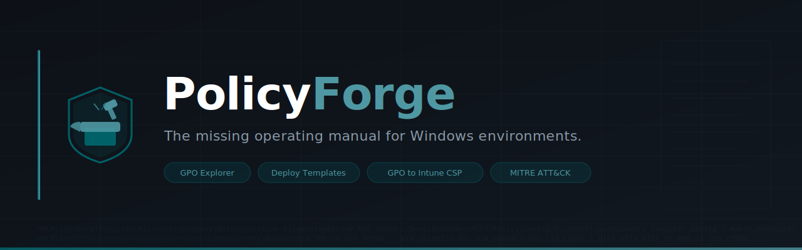

<p align="center">
  
</p>

<p align="center">
  <a href="https://github.com/SamoTech/PolicyForge"></a>
  
  
  
  
  
</p>

---

**PolicyForge** is the most advanced open-source platform for IT professionals, sysadmins, and security engineers who work with Microsoft Group Policy (GPO), Intune MDM/CSP, and Windows configuration at scale.

> Stop guessing what policies do. Start **engineering** Windows environments with precision.

---

## 🧠 Why PolicyForge Exists

Microsoft's ecosystem is **fragmented by design**:

| Tool | Problem |
|---|---|
| ADMX files | Machine-readable, not human-readable at scale |
| Group Policy Editor | Zero real-world context or impact documentation |
| Intune / MDM CSP | Completely different naming language from GPO |
| Security baselines | Rigid, undocumented, impossible to customize safely |

The result? Admins copy configs blindly without understanding what they're deploying or why.

**PolicyForge is the StackOverflow + GitHub + Docs hybrid for Windows policy engineering.**

---

## 🚀 Features

| Feature | Status |
|---|---|
| 10,000+ policies indexed with real-world context | 🔄 In Progress |
| Use-case mapping: enterprise, SMB, offensive, defensive | ✅ Available |
| Pre-built deployment templates (baseline → hardening → kiosk) | ✅ Available |
| GPO ↔ Intune ↔ Registry ↔ PowerShell translation engine | ✅ Available |
| ADMX auto-parser & bulk doc generator | ✅ Available |
| Policy diff tracker (Win10 vs Win11 vs Server) | 🔄 In Progress |
| MITRE ATT&CK mapping for every security policy | ✅ Available |
| CIS / DISA STIG / NIST compliance cross-references | ✅ Available |
| **Web UI — searchable policy browser** | 🔄 Planned (Phase 4) |
| **AI policy recommendation engine** | 🔄 Planned (Phase 5) |

---

## 📂 Repository Structure

```
PolicyForge/
│
├── 📁 policies/
│   ├── windows/          # Windows OS policies (privacy, security, network, ...)
│   ├── edge/             # Microsoft Edge browser policies
│   ├── defender/         # Windows Defender / Antivirus policies
│   ├── office/           # Microsoft 365 / Office policies
│   └── server/           # Windows Server role policies
│
├── 📁 templates/
│   ├── security-baselines/    # CIS / DISA STIG-aligned baselines
│   ├── performance/           # High-performance workstation configs
│   ├── kiosk-mode/            # Locked-down kiosk deployments
│   ├── gaming-optimization/   # Gaming PC GPO optimization
│   ├── enterprise-hardening/  # Enterprise endpoint hardening pack
│   └── redteam-evasion/       # ⚠️ Research: attacker-abused misconfigs
│
├── 📁 translations/
│   ├── gpo-to-intune/         # Group Policy → Intune CSP mappings
│   ├── registry-mapping/      # Registry key ↔ ADMX mapping tables
│   └── powershell/            # PowerShell equivalents for all policies
│
├── 📁 automation/
│   ├── admx-parser/           # ADMX → Markdown bulk doc generator
│   ├── policy-diff/           # Compare policies across OS versions
│   └── auto-doc-generator/    # Batch documentation automation
│
├── 📁 dashboards/
│   └── web-ui/                # 🌐 Next.js searchable policy browser
│
├── 📁 assets/
│   ├── banner.svg             # Repository banner
│   └── logo.svg               # PolicyForge logo mark
│
├── POLICY_SCHEMA.json
├── CONTRIBUTING.md
└── README.md
```

---

## 🧪 Example Use Cases

- **Harden endpoints against ransomware** → `templates/enterprise-hardening/`
- **Migrate GPO to Intune** → `translations/gpo-to-intune/`
- **Build kiosk / lockdown environments** → `templates/kiosk-mode/`
- **Disable telemetry (tested configs)** → `policies/windows/privacy/`
- **Red team research** → `templates/redteam-evasion/` ⚠️
- **Auto-document your ADMX files** → `automation/admx-parser/`

---

## 📋 Policy Entry Format

Every policy follows the schema in [`POLICY_SCHEMA.json`](POLICY_SCHEMA.json). Template at [`policies/_TEMPLATE.md`](policies/_TEMPLATE.md).

```yaml
# Example: WIN-SECURITY-002
Name:      Disable SMBv1 Protocol
Registry:  HKLM\SYSTEM\CurrentControlSet\Services\LanmanServer\Parameters > SMB1 = 0
Intune:    ./Device/Vendor/MSFT/Policy/Config/... (see translation)
Risk:      Critical
MITRE:     T1210, T1021.002, T1570
Compliance: CIS Level 1 · DISA STIG WN10-00-000160 · NIST SI-3
Tested:    ✅ Windows 10 22H2, Windows 11 24H2, Server 2022
```

---

## ⚙️ Automation

```bash
# Parse all ADMX files → generate Markdown docs in bulk
cd automation/admx-parser
python admx_parser.py \
  --input "C:\Windows\PolicyDefinitions" \
  --output ../../policies/windows/ \
  --format both

# Compare policies across Windows versions
cd automation/policy-diff
python policy_diff.py --old win10 --new win11 --output ./reports/
```

---

## 🌐 Web UI (Coming — Phase 4)

A Next.js-powered policy browser that lets you:

- **Search policies like Google** — full-text, tag, and category search
- **Filter by** OS version, risk level, compliance framework, use case
- **Generate templates** — select policies → download `.reg`, `.ps1`, or GPO backup
- **Translate on the fly** — paste a registry key, get the Intune CSP equivalent
- **Policy Simulator** — predict conflicts before deployment

The web UI reads directly from this repository's Markdown files — no separate database.

> 🔗 Preview launching after Phase 3 contributor milestone.

---

## 🗺️ Full Roadmap

### ✅ Phase 1 — Foundation (Day 1–3) — COMPLETE
- [x] Repository scaffold, schema, and contributing guide
- [x] Logo and banner assets
- [x] First 3 high-impact policies with full translations
  - `WIN-PRIVACY-001` — Disable Windows Telemetry
  - `WIN-SECURITY-001` — Disable AutoRun / AutoPlay
  - `WIN-SECURITY-002` — Disable SMBv1 Protocol
- [x] Enterprise security baseline template
- [x] ADMX parser automation script
- [x] GPO → Intune translation structure
- [x] GitHub issue & PR templates

### 🔄 Phase 2 — Scale (Week 1)
- [ ] Run ADMX parser → import 500+ policies from Windows PolicyDefinitions
- [ ] Complete `policies/windows/security/` — 50 critical policies
- [ ] Complete `policies/windows/privacy/` — 20 privacy policies
- [ ] Complete `policies/defender/` — 30 Defender policies
- [ ] Add `gaming-optimization` template
- [ ] Add `kiosk-mode` template
- [ ] Policy diff tool (`automation/policy-diff/`)
- [ ] Publish on **r/sysadmin** and **r/netsec**

### 🔄 Phase 3 — Translation Engine (Week 2)
- [ ] `translations/gpo-to-intune/windows-security.md` — 50+ mappings
- [ ] `translations/gpo-to-intune/windows-privacy.md`
- [ ] `translations/registry-mapping/` — Registry ↔ ADMX cross-reference table
- [ ] `translations/powershell/` — PowerShell deployment scripts per category
- [ ] Contributor leaderboard and badge system live
- [ ] Launch on **LinkedIn** and **GitHub Trending**

### 🔄 Phase 4 — Web UI (Week 3+)
- [ ] Next.js web app in `dashboards/web-ui/`
- [ ] Full-text policy search engine
- [ ] Filter: OS version, risk level, compliance, use case
- [ ] Template generator: select policies → export pack (`.reg`, `.ps1`, GPO)
- [ ] On-the-fly GPO ↔ Intune translator
- [ ] Deploy to Vercel (free tier)

### 🔄 Phase 5 — AI Layer (Month 2)
- [ ] AI recommendation engine
  - Input: "Secure 50 SMB endpoints against ransomware"
  - Output: Full GPO pack + Intune profile
- [ ] Policy conflict detector
- [ ] Natural language policy search
- [ ] **SaaS consideration** (60–90 day horizon)

---

## 🔐 Security Research Layer

| Track | Description |
|---|---|
| 🛡️ Defensive | Policies that close attack surface (MITRE ATT&CK mitigations) |
| ⚔️ Offensive Research | Misconfigurations attackers actively abuse |
| 🔍 Detection | Audit policies that surface attacker behavior in logs |

All entries cross-reference MITRE ATT&CK techniques, CIS Controls, and DISA STIGs.

---

## 🤝 Contributing

See [CONTRIBUTING.md](CONTRIBUTING.md). Every contribution counts:

- 📝 Policy explanations and real-world context
- 🛠️ Templates and deployment packs
- 🔄 GPO ↔ Intune translation mappings
- 🧪 Test results from different Windows versions
- 🔐 Security research and MITRE ATT&CK mappings

### 🏆 Contributor Badges

| Badge | Criteria |
|---|---|
| 🥇 Core Contributor | 10+ merged policy entries |
| 🎯 Policy Hunter | First to document a new policy |
| 🧠 Zero-Day Config Finder | Security research with MITRE reference |
| 🛠️ Template Architect | Template used by 10+ contributors |
| 🤖 Automation Builder | Merged automation tool |

---

## ⚠️ Disclaimer

The `templates/redteam-evasion/` directory contains research-grade configurations documenting how attackers abuse Group Policy. Provided **for defensive research and education only**.

---

## 📄 License

MIT License — see [LICENSE](LICENSE) for details.

---

<p align="center">
  
  <br/><br/>
  <strong>PolicyForge</strong> — The missing operating manual for Windows environments.<br/>
  Built by the community, for the community.
</p>
